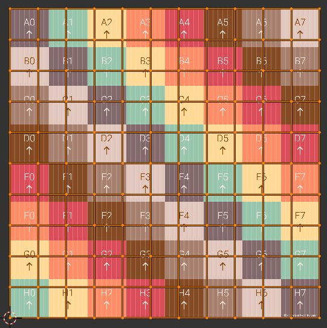
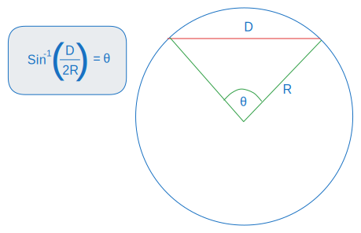
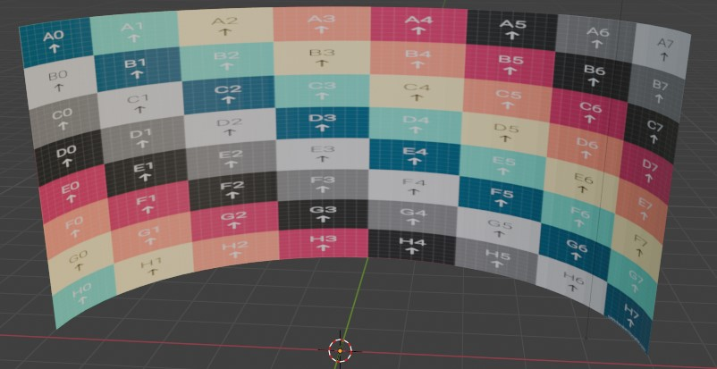
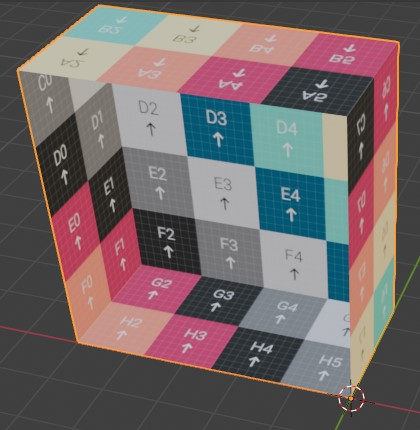

# Modelling 3d displays - a journey

I've recently undertaken a learning journey into making 3d displays easier to get pixel perfect.
As part of working on OpenTSG and the recently updated TSIGs I've been developing a [command line tool](https://gitlab.com/mm-eng/tsig-demos), 
to help other people.

When first tasked with making 3d displays from led tiles, I threw myself into the task by starting with a
shape not traditionally associated with squares, a sphere, or at least a portion of a sphere.
After quickly (not quick enough) realising the torment I had put myself through, I took a step back and decided to start with
shapes that are more amicable to being made up of squares, which is where this blog post starts.

We will cover two displays in this first blog post, a curved wall and an open cube.
The second blog post will cover the spheres, so if you would like to jump ahead and not heed my warning then do so here *inseert link*

The outcome of these blogs can be found in command line [here](https://gitlab.com/mm-eng/tsig-demos)

## Object 1 - The curved wall

I started with the curved wall as this had the simplest UV map, which was the same as a flat wall made up of squares.
If you are not familiar with what a UV map is, then check out this [handy link](https://conceptartempire.com/uv-mapping-unwrapping/)

See how simple this uv map looks an note how it takes up the whole image.
For generating a curved wall we will be working in [cylindrical coordinates](https://en.wikipedia.org/wiki/Cylindrical_coordinate_system),
as this allows us to handle the angular increments of the tiles along the wall.
Furthermore as the tiles only change angle in one direction, there is no change in the width of the
wall as the height changes, this is something we have to consider for more complicated objects.

The first step was converting the tile width distance to an angle, so that each angle increment was a single unit of tile width.
This can be done with the chordal length formula.

This takes a distance between two points on a circle and gives the angle between them from the origin.
The angle increment of each tile is uniform so we could now calculate how many tiles wide the wall is.

The vertical tile count is more trivial with it just being the height of the wall/ the height of the tiles.
As there are thankfully no angles in this plane.

The plan was then to iterate the tiles along the circumference, one tile angle at a time.
We could then generate the corresponding four corner vertexes of the tile and the corresponding UV map.
The vertexes corners corresponded to min radius + increment, z + tileHeight. The radius is constant throughout.
These cylindrical coordinates were then converted to cartesian ones with following formulas.

The uv map was created by adding the tile heights and widths, treating it as a completely flat object.

After doing this and getting weird triangle shaped tiles I realised that the order of vertices were important!
The shape you get is based on the order you join the dots, so if it isn't sequential then things will get funky fast.
The order I settled on for this and all other shapes in the blogs, was
bottom left, bottom right, top right and then top left in an anti clockwise order. For v1,v2,v3 and v4 respectively

Then when this was done the uv map first generated an inverse image, I had got the horizontal coordinates flipped :\( .
I had to flip them to calibrate the uv map to math the viewing experience from the centre of the screen.

## Object 2 The cube

The next object to be tackled was an open cube, this is also simpler than a sphere,
by virtue of there being smooth surfaces or difficult shapes to accommodate.

The cube also had the added bonus of being in cartesian coordinates,
so no nasty angles were required for calculating vertex positions.
To make our lives simpler, each cube face calculation was designed to only move in 2d,  where the third plane
was constant.
E.g. the back panel of the cube is constant in the direction y, so when moving tiles along,
only the x(for width) and z (for height) coordinates were changed.

This process tile position algorithm was repeated for the top and bottom of the cube (constant z plane)
and side panels (constant x plane)
following the anticlockwise motion for assigning vertexes
described earlier.

So now we have a object we need to do the uv map, which we required some creative intent, as the cube can be unfolded in a myriad of ways.
Unlike a cylindrical wall, which had a pretty cut and dry approach to UV maps. We went for the design below that centred around the back wall,
as this would seem to be the focus in a led room with an open doorway.

However this was not the end for the cube UV map, as each mirroring face had one facing the wrong direction.
The horizontal coordinates then had to be flipped again for the right wall and the vertical coordinates of the
bottom panel. This was sometimes figured out through trial and error.

